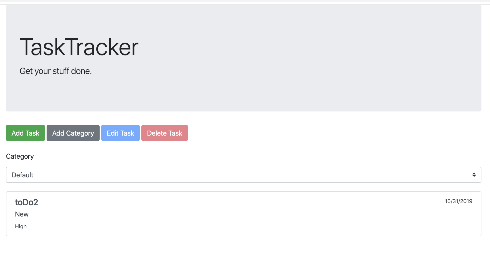

To Do List project from The Odin project curriculum: https://www.theodinproject.com/courses/javascript/lessons/todo-list

Live: https://morrisrob.github.io/Todo/dist/index.html

To Do List CRUD application built using Javascript.  Data does not persist.  The application offers the ability to add categories, and to do list items, as well as Edit entries after they are saved.

